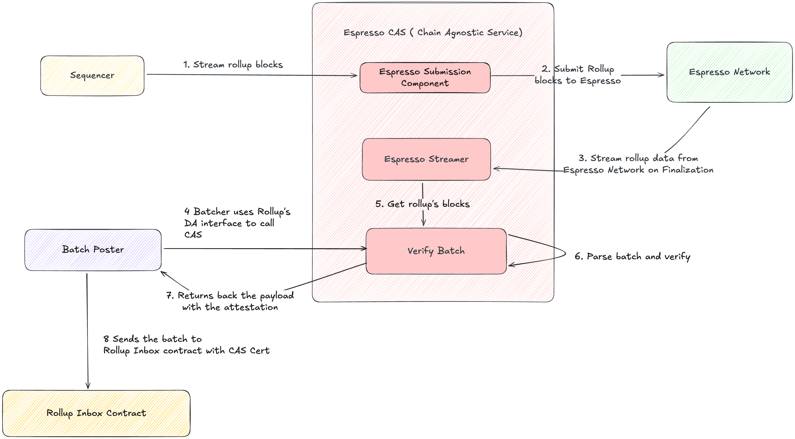

# Chain Adjacent Service

The Chain Adjacent Service (CAS) is a middleware that integrates rollups with the [Espresso](https://www.espressosys.com/) Network. It sits between a rollup node and the Espresso sequencer, handling both directions of the data flow:

- **Inbound (Streamer)**: pulls transactions from Espresso, filtered by rollup namespace, verifies them against L1 batch postings, and queues them for the rollup.
- **Outbound (Submitter)**: receives messages from the rollup's feed, batches them into Espresso transactions, and submits them to the sequencer.

CAS exposes a JSON-RPC **DA provider API** that plugs directly into the rollup's existing DA interface — the rollup does not need to be aware of Espresso internals. Rollup-specific logic (batch parsing, feed relay, L1 monitoring, verification) is isolated behind a `Rollup` trait, making it straightforward to add support for new rollup stacks.

**Currently supported:** Arbitrum Nitro (v3.9.9 and v3.10).

## Architecture




Key modules under `src/`:

| Module | Purpose |
|---|---|
| `da_api/` | JSON-RPC DA provider server (axum). Handles `Store`/`GetByHash` and supports calldata + AnyTrust providers. |
| `streamer/` | Polls Espresso blocks, extracts namespace transactions, manages verification queue. |
| `submitter/` | Batches feed messages and submits Espresso transactions. |
| `espresso_client/` | HTTP/WS client for the Espresso sequencer API. |
| `key_manager/` | TEE key management (AWS Nitro Enclaves), attestation verification, on-chain signer registration. |
| `rollups/` | `Rollup` trait definition + Nitro implementation (batch parsing, L1 monitor, feed relay). |
| `secrets.rs` | AWS Secrets Manager integration for runtime secret overrides. |
| `config.rs` | JSON configuration deserialization. |

## Feature Flags

Nitro protocol versions are mutually exclusive features:

| Feature | Description |
|---|---|
| `nitro-v3_9_9` (default) | Arbitrum Nitro v3.9.9 protocol |
| `nitro-v3_10` | Arbitrum Nitro v3.10 protocol |

Build for a specific version:

```bash
cargo build --release --no-default-features --features nitro-v3_10
```

## Development

### Prerequisites

- **Rust 1.93.1** (pinned in `rust-toolchain.toml`)
- **Docker** (for E2E tests)

### Getting Started

```bash
# Ensure rustup picks up rust-toolchain.toml automatically.

# Verify prerequisites
just check

# Build
just build

# Check formatting
just fmt

# Clippy (pick one — features are mutually exclusive)
just clippy-v3_9_9
just clippy-v3_10
```

## Configuration

CAS reads a JSON config file specified via CLI or environment variable:

```bash
chain-adjacent-service --config /path/to/config.json
```

Secrets can be injected at runtime via **AWS Secrets Manager** — see `.env.example` for the required environment variables.

## Running

### Binary

```bash
just build
./target/release/chain-adjacent-service --config config.json
```

### Docker

```bash
# Default build (Nitro v3.9.9)
just docker-build

# Nitro v3.10
docker build --build-arg CARGO_FEATURES=nitro-v3_10 -t cas:v3.10 .

# Run
docker run -v /path/to/config.json:/etc/cas/config.json cas:v3.10
```

The image runs as a non-root user and expects the config at `/etc/cas/config.json` by default.

## Testing

### Unit Tests

```bash
just test
```

Runs `cargo test --all-features` (sequential).

### E2E Tests

E2E tests spin up a full Nitro stack via Docker Compose.

```bash
# Nitro v3.10 (default)
just test-e2e

# Nitro v3.9.9 (requires generated L1 state)
just generate-l1-state-v3_9_9
just test-e2e-v3_9_9

# Optional: filter to a specific test
just test-e2e test_e2e_anytrust
```

### Docker Compose Helpers

```bash
just e2e-up              # Start Nitro v3.10 stack
just e2e-down            # Stop Nitro v3.10 stack
just e2e-up-v3_9_9       # Start Nitro v3.9.9 stack
just e2e-down-v3_9_9     # Stop Nitro v3.9.9 stack
just clean               # Tear down all leftover E2E containers
```

## CI

GitHub Actions runs on every push to `main` and on pull requests:

| Job | What it does |
|---|---|
| **Formatting** | `cargo fmt --all --check` |
| **Tests** | `cargo test --all-targets` |
| **Clippy** | Runs separately per Nitro version (mutually exclusive features) |
| **Audit** | `cargo audit` via rustsec |

## License

Copyright
(c) 2022 Espresso Systems espresso-network was developed by Espresso Systems. While we plan to adopt an open source license, we have not yet selected one. As such, all rights are reserved for the time being. Please reach out to us if you have thoughts on licensing.

## Disclaimer

DISCLAIMER: This software is provided "as is" and its security has not been externally audited. Use at your own risk.

DISCLAIMER: The Rust library crates provided in this repository are intended primarily for use by the binary targets in this repository. We make no guarantees of public API stability. If you are building on these crates, reach out by opening an issue to discuss the APIs you need.
